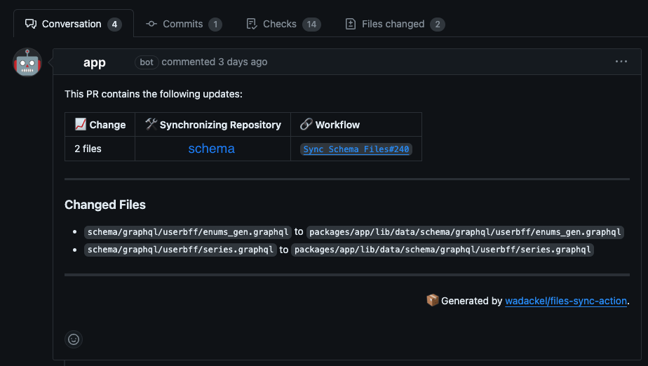
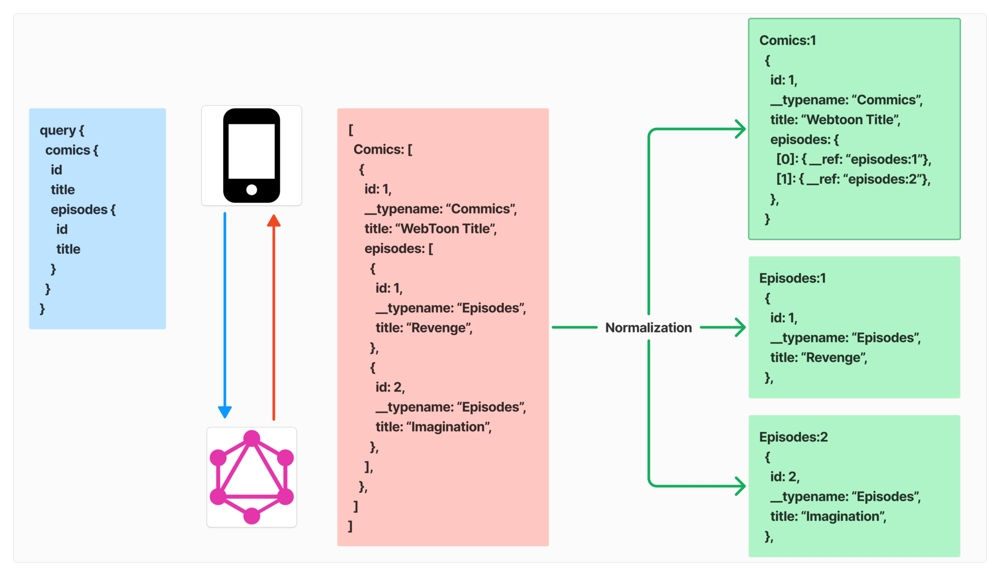
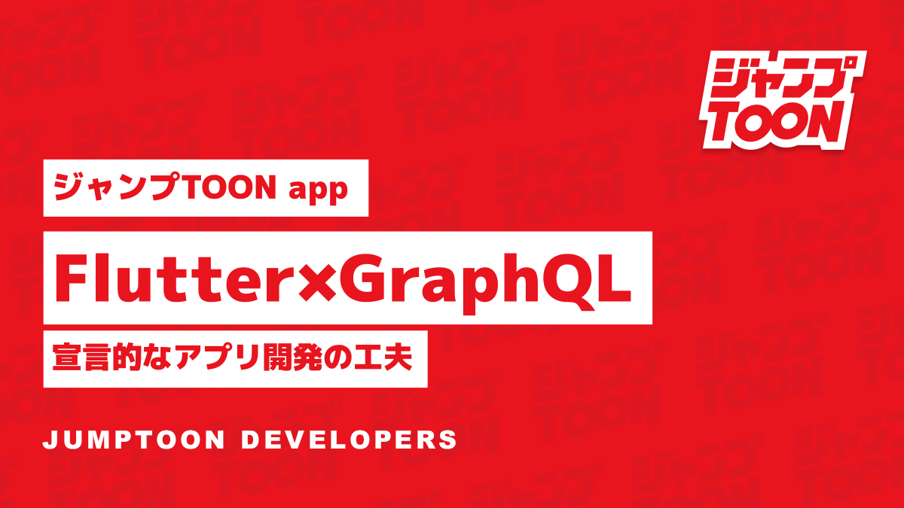

<!-- _class: title -->

# **Flutter × GraphQL**

### **宣言的モバイルアプリ開発**

#### 2025/2/7
#### 吉田 航己

---

<!-- header: 自己紹介 -->

## 吉田 航己
## Yoshida Koki

<br>
株式会社サイバーエージェント
<br>
モバイルアプリエンジニア

### X : [@koki8442](https://x.com/koki8442)
### GitHub : [lllttt06](https://github.com/lllttt06)


---

## 目次

#### 1. GraphQL の概要
#### 2. ジャンプTOON の GraphQL 活用
#### 3. Flutter で GraphQL を使う利点
#### 4. Flutter × GraphQL 開発の工夫
#### 5. おわりに

---

<!-- header: 1. GraphQL の概要 -->

### GraphQL とは？

**REST の問題を解決するための API クエリ言語およびランタイム**

- データを Node と Edge のグラフで構造化し、必要に応じてそのグラフの一部を利用する
- 単一のエンドポイントから必要なデータだけを Query するため、オーバー(アンダー)フェッチを防げる

---

<!-- header: 2. ジャンプTOON での GraphQL 活用 -->

### 使用パッケージ

GraphQL クライアント：[graphql_flutter](https://pub.dev/packages/graphql_flutter) ([graphql](https://pub.dev/packages/graphql)) 

GraphQL 自動生成関連：[graphql_codegen](https://pub.dev/packages/graphql_codegen)

---

<!-- header: 2. ジャンプTOON での GraphQL 活用 -->

<style scoped>
  pre {
    max-height: 450px;
    overflow-y: auto;
    white-space: pre-wrap;
  }
 .columns {
    display: grid;
    grid-template-columns: repeat(2, minmax(0, 1fr));
    gap: 1rem;
  }
</style>

### SettingScreen の例

データの取得を Screen 内の `useQuery$Setting` で行う


<div class="columns">
<div>

```dart
// setting_screen.dart
class SettingScreen extends HookConsumerWidget {
  const SettingScreen({super.key});
  @override
  Widget build(BuildContext context, WidgetRef ref) {
    final isGuestUser = useIsGuestUser();
    final query = useQuery$Setting(options);
    return Scaffold(
      // ...
      body: GraphQLQueryContainer(
        query: query,
        onLoadingWidget: SkeletonSettingScreen(isGuestUser: isGuestUser),
        onErrorWidget: (error, stackTrace) => ErrorContainer(
          error: error,
          stackTrace: stackTrace,
          onAction: query.refetch,
        ),
        child: (data) {
          return SingleChildScrollView(
            // ...
          );
        },
      ),
    );
  }
}
```
</div>
<div>

```dart
// graphql_query_container.dart
class GraphQLQueryContainer extends HookWidget {
  const GraphQLQueryContainer({
    required this.query,
    required this.child,
    this.onLoadingWidget,
    this.onEmptyWidget,
    this.onErrorWidget,
    super.key,
  });

  final QueryHookResult query;
  final Widget Function(TParsed data) child;
  final Widget? onLoadingWidget;
  final Widget? onEmptyWidget;
  final Widget Function(GraphQLException error, StackTrace? stackTrace)?
      onErrorWidget;

  @override
  Widget build(BuildContext context) {
    if (result.hasException && onErrorWidget != null) {
      // エラーが発生した場合
      return onErrorWidget!(
        GraphQLException.fromOperationException(result.exception),
        StackTrace.current,
      );
    } else if (result.data == null && result.isNotLoading) {
      // データがない場合
      return onEmptyWidget ?? const SizedBox();
    } else if (result.data == null && result.isLoading) {
      // ローディング状態
      return onLoadingWidget ?? const SizedBox();
    } else {
      // データが存在する場合
      return child(result.parsedData as TParsed);
    }
  }
}
```
</div>
</div>

---

<style scoped>
  pre > code {
    max-height: 600px;
    overflow-y: auto;
    white-space: pre-wrap;
  }
 .columns {
    display: grid;
    grid-template-columns: repeat(2, minmax(0, 1fr));
    gap: 1rem;
  }
</style>

<!-- header: 2. ジャンプTOON での GraphQL 活用 -->

### query の定義と自動生成ファイル

query を `.graphql` に記述し、`.dart` のコードを自動生成する

<div class="columns">
<div>

```graphql
# setting_screen_query.graphql
query Setting {
  me {
    id
  }
}
```
</div>
<div>

```dart
// setting_screen_query.graphql.dart
class Query$Setting {
  Query$Setting({
    required this.me,
    this.$__typename = 'Query',
  });

  factory Query$Setting.fromJson(Map<String, dynamic> json) {
    final l$me = json['me'];
    final l$$__typename = json['__typename'];
    return Query$Setting(
      me: Query$Setting$me.fromJson((l$me as Map<String, dynamic>)),
      $__typename: (l$$__typename as String),
    );
  }

  final Query$Setting$me me;

  final String $__typename;

  Map<String, dynamic> toJson() {
    final _resultData = <String, dynamic>{};
    final l$me = me;
    _resultData['me'] = l$me.toJson();
    final l$$__typename = $__typename;
    _resultData['__typename'] = l$$__typename;
    return _resultData;
  }

  @override
  int get hashCode {
    // ...
  }

  @override
  bool operator ==(Object other) {
    // ...
  }
}

class Query$Setting$me {
  Query$Setting$me({
    required this.id,
    this.$__typename = 'User',
  });

  factory Query$Setting$me.fromJson(Map<String, dynamic> json) {
    final l$id = json['id'];
    final l$$__typename = json['__typename'];
    return Query$Setting$me(
      id: (l$id as String),
      $__typename: (l$$__typename as String),
    );
  }

  final String id;

  final String $__typename;

  Map<String, dynamic> toJson() {
    final _resultData = <String, dynamic>{};
    final l$id = id;
    _resultData['id'] = l$id;
    final l$$__typename = $__typename;
    _resultData['__typename'] = l$$__typename;
    return _resultData;
  }

  @override
  int get hashCode {
    // ...
  }

  @override
  bool operator ==(Object other) {
    // ...
  }
}

// ...

graphql_flutter.QueryHookResult<Query$Setting> useQuery$Setting(
        [Options$Query$Setting? options]) =>
    graphql_flutter.useQuery(options ?? Options$Query$Setting());

// ...
```
</div>
</div>

---

<!-- header: 2. ジャンプTOON での GraphQL 活用 -->

<style scoped>
  pre > code {
    max-height: 400px;
    overflow-y: auto;
    white-space: pre-wrap;
  }
</style>

### Fragment Colocation
コンポーネントとそこで使用するデータ郡(fragment)を1:1対応させ、近くに配置 ([参考資料](https://speakerdeck.com/quramy/fragment-composition-of-graphql))

```
ui/
├── component/
│   └── text/
│       ├── user_name_text_fragment.graphql
│       ├── user_name_text_fragment.graphql.dart
│       └── user_name_text.dart
└──screen/
    └── root/
        └── my_page/
            ├── my_page_query.graphql
            ├── my_page_query.graphql.dart
            └── my_page_screen.dart
```

---
<!-- header: 3. Flutter × GraphQL の利点 -->

## Flutter × GraphQL の利点

#### 1. スキーマファースト開発
#### 2. クライアントキャッシュ
#### 3. 宣言的 UI との親和性

---

<!-- header: 3. Flutter × GraphQL の利点 -->

## スキーマファースト開発

**最初に GraphQL Schema を定義し、Schema 定義に合うようにコード(API など)を実装する手法**
- クライアントーサーバー間のコミュニケーションコスト削減
- API 実装完了前でも Schema からデータをモック可能
- [file-sync-action](https://github.com/wadackel/files-sync-action) でサーバーでマージした Schema を同期

---

## スキーマファースト開発



---
<!-- header: 3. Flutter × GraphQL の利点 -->

## クライアントキャッシュ
モバイルアプリにとって個人的に GraphQL を採用する一番のメリット

GraphQL クライアントでは、Query, Mutation などの Operation の結果を**正規化**してキャッシュ。正規化は以下の 3 ステップで行われる。

1. Operation 結果を分割して個別のオブジェクトにする
2. 分割したオブジェクトに一意の key をつける
3. それぞれのオブジェクトをフラットに保存する

---

<!-- header: 3. Flutter × GraphQL の利点 -->

## クライアントキャッシュ

<style scoped>
  pre > code {
    max-height: 500px;
    overflow-y: auto;
    white-space: pre-wrap;
  }
 .columns {
    display: grid;
    grid-template-columns: repeat(2, minmax(0, 1fr));
    gap: 1rem;
  }
</style>

<div class="columns">
<div>

```graphql
# リクエスト
query {
  comics {
    id
    title
    episodes {
      id
      title
  }
}
```
</div>
<div>

```yaml
# レスポンス
[   
  Comics: [
    {
      id: 1,
      __typename: “Commics”,
      title: “WebToon Title”,
      episodes: [
        {
          id: 1,
          __typename: “Episodes”,
          title: “Revenge”,
        },
        {
          id: 2,
          __typename: “Episodes”,
          title: “Imagination”,
        },
      ],
    },     
  ]
]
```
</div>
</div>

---

<!-- header: 3. Flutter × GraphQL の利点 -->



---

<!-- header: 3. Flutter × GraphQL の利点 -->

## クライアントキャッシュ

キャッシュの更新、保存を自動で GraphQL クライアントが行う

<br>

`useQuery` を使用している Widget は別の Query や Mutation でのキャッシュの更新に伴って UI も自動で更新される


---
<!-- header: 3. Flutter × GraphQL の利点 -->

## 宣言的 UI との親和性
データを元に UI を構築する宣言的 UI は、
GraphQL クライアントのキャッシュ機構との親和性が高い。

ある Operation で正規化されたキャッシュデータが更新されると、
それを参照しているすべての UI が更新されるため。


### REST では同じことは出来ないの？？
<!-- この GraphQL クライアント技術の利点は REST にも応用可能。 -->
<!-- 実際に Redux の公式ドキュメントでも [Store データの正規化](https://redux.js.org/usage/structuring-reducers/normalizing-state-shape)について言及されている。 -->

---

<!-- header: 3. Flutter × GraphQL の利点 -->

## 宣言的 UI との親和性
- Redux の公式ドキュメント [Store データの正規化](https://redux.js.org/usage/structuring-reducers/normalizing-state-shape)
→ 正規化を手動で行う必要がある。GraphQL はデータの構造が Schema に **Graph** として表現されているため機械的にこれができる。

- React の [TanStack Query](https://tanstack.com/query/latest/docs/framework/react/overview) や [SWR](https://swr.vercel.app/ja)
→ 基本的に URL を key としてキャッシュするため、個々のデータに分割してキャッシュされない。
→ Flutter にはこれらにインスパイアされた [fQuery](https://pub.dev/packages/fquery) がある。

---

## おわりに
詳細は[こちら](https://developers.cyberagent.co.jp/blog/archives/48956/)
[](https://developers.cyberagent.co.jp/blog/archives/48956/)


---

<!-- header: ''-->

## 参考文献

- [GraphQL](https://graphql.org/)
- [Caching in Apollo Client](https://www.apollographql.com/docs/react/caching/overview/)
- [Demystifying Cache Normalization](https://www.apollographql.com/blog/demystifying-cache-normalization)
- [Normalizing State Shape](https://redux.js.org/usage/structuring-reducers/normalizing-state-shape)
- [GraphQL Client Architecture Recommendation 社外版](https://engineering.mercari.com/blog/entry/20221215-graphql-client-architecture-recommendation/)
- [宣言的UIの状態管理とアーキテクチャSwiftUIとGraphQLによる実践/swiftui-graphql](https://speakerdeck.com/sonatard/swiftui-graphql)
